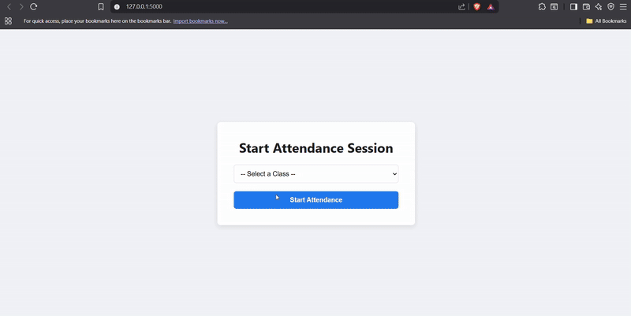

# Intelligent Attendance System with Facial Recognition


A smart, real-time attendance tracking platform featuring a web-based UI, class scheduling, time-gated sessions, and anti-spoofing liveness checks.

---

## 🎥 Live Demo



## 📋 Problem Statement

Traditional methods of tracking attendance are inefficient, prone to human error, and susceptible to fraud like proxy attendance. This project solves these issues by providing a "touchless," automated, and secure system that can accurately track attendance without disrupting the flow of a lecture or meeting.

## ✨ Key Features

- **Web-Based Dashboard:** A clean, modern UI to view the live camera feed and a real-time attendance log.
- **Scheduling System:** Instructors can pre-define classes and schedules in the database.
- **Session Management:** The application starts with a setup page where the instructor selects a specific class session for the day.
- **Time-Gated Attendance:** The system is "schedule-aware"—attendance is only marked during the scheduled start and end times of the selected class.
- **Manual Session Control:** Instructors can manually end an attendance session at any time with an "End Attendance" button.
- **Anti-Spoofing Liveness Check:** A security layer that uses image sharpness analysis to differentiate between a live person and a photo, preventing fraud.
- **Real-Time Visual Feedback:** The video feed displays the status (`ACTIVE`, `ENDED`), recognized names, and liveness scores.
- **Performance Optimized:** The heavy AI model only runs once per second to ensure smooth performance on standard hardware.

## 🏛️ System Architecture

The application is built on a robust client-server model:
- **Backend (Flask):** A Python-based server that handles the core logic, including the RESTful API, database operations, real-time video processing with OpenCV, and facial recognition with DeepFace.
- **Database (MongoDB):** A NoSQL database that stores all persistent data, including `users`, `classes`, `schedules`, and `attendance` records.
- **Frontend (HTML/CSS/JS):** A dynamic, single-page-style application that communicates with the backend via API calls to display the live video feed and attendance logs without needing to reload the page.

## 🖼️ Screenshots

| Setup Page | Live Dashboard (Attendance Active) |
| :---: | :---: |
| *Select a scheduled class to begin the session.* | *Real-time recognition with session log.* |
|  |  |

| Live Dashboard (Another User) | Live Dashboard (Session Ended) |
| :---: | :---: |
|  |  |

## 🚀 Getting Started

Follow these steps to set up and run the project on your local machine.

### Prerequisites
- Python 3.10 or newer
- A running MongoDB instance (local or cloud-based like MongoDB Atlas)
- A connected webcam

### 1. Clone the Repository
```bash
git clone [https://github.com/mohitrock850/Intelligent-Attendance-System.git](https://github.com/mohitrock850/Intelligent-Attendance-System.git)
cd Intelligent-Attendance-System
```

### 2. Set Up a Virtual Environment
This keeps your project dependencies isolated.
```bash
# For macOS/Linux
python3 -m venv venv
source venv/bin/activate

# For Windows
python -m venv venv
.\venv\Scripts\activate
```

### 3. Install Dependencies
```bash
pip install -r requirements.txt
```

### 4. Configure the Database
- Open the `backend/database.py` file.
- Update the `MONGO_CONNECTION_STRING` variable with your own MongoDB connection details.

### 5. Run the One-Time Setup Scripts
These scripts will create the database collections, register your sample users, and set up a schedule for today.
```bash
# 1. Initialize the database collections and indexes
python backend/database.py

# 2. Register your sample users (edit the file to add your own images in the 'data' folder)
python register_faces.py

# 3. Create a sample schedule for the current day
python setup_schedule.py
```

### 6. Launch the Application
```bash
python run_backend.py
```
The server will start. Now, open your web browser and navigate to **http://127.0.0.1:5000/** to begin.

---

👥 Contributors
This project was developed by:

Mohit - mohitrock850

[Sachin Yadav] - [https://github.com/Sachinydv3/]


## ⚠️ Important Notes & Potential Issues

-   **Face Recognition Accuracy:** The accuracy of facial recognition can vary significantly based on:
    -   **Training Data:** The quality and quantity of images used to register faces. Ensure faces are well-lit, frontal, and free from obstructions.
    -   **Lighting Conditions:** Poor lighting can drastically reduce recognition performance.
    -   **Camera Quality:** A higher-resolution webcam will generally yield better results.
-   **Device Compatibility:**
    -   **Webcam Access:** Ensure your operating system grants Python/OpenCV access to your webcam.
    -   **Resource Usage:** Real-time face recognition can be CPU-intensive. Performance may vary on older or less powerful machines.
